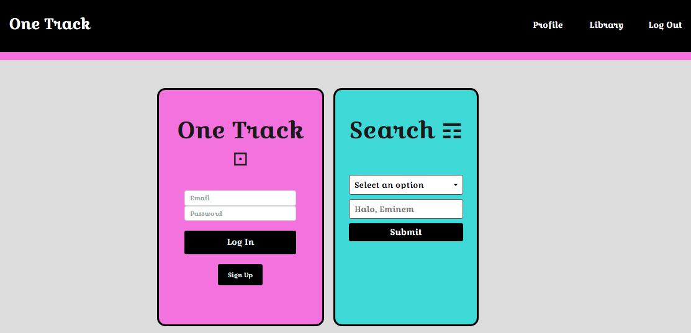
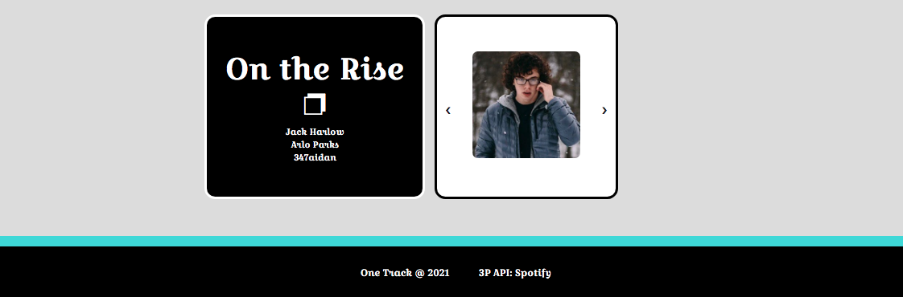
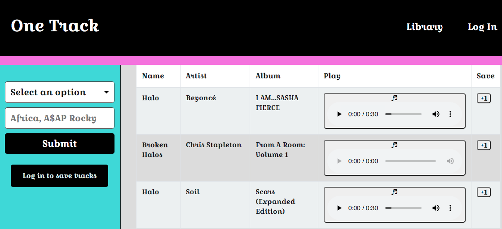
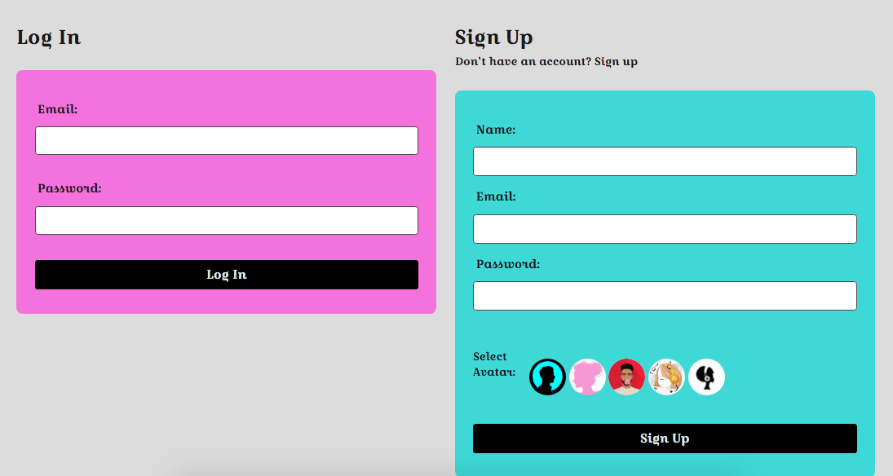
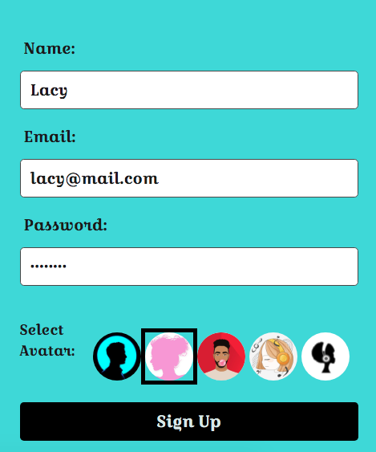
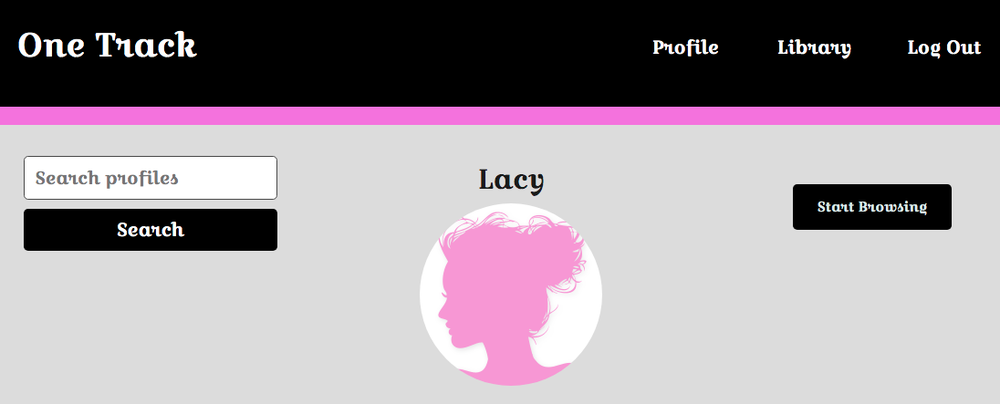
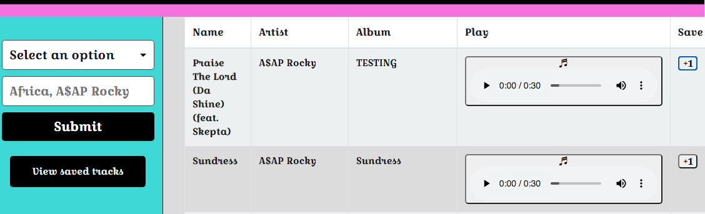
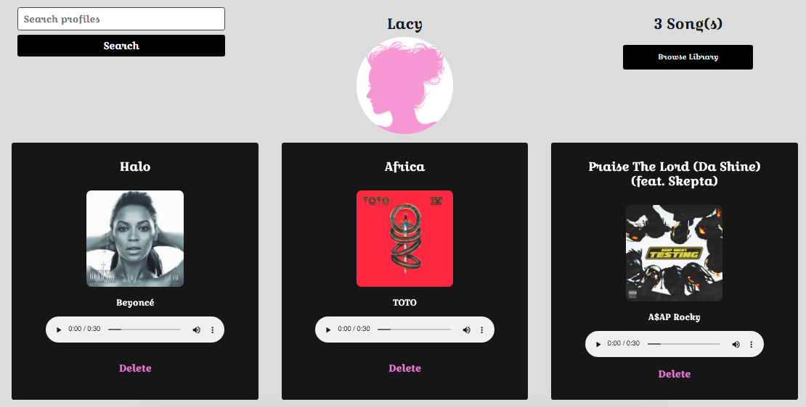
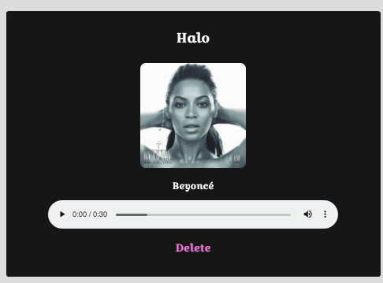
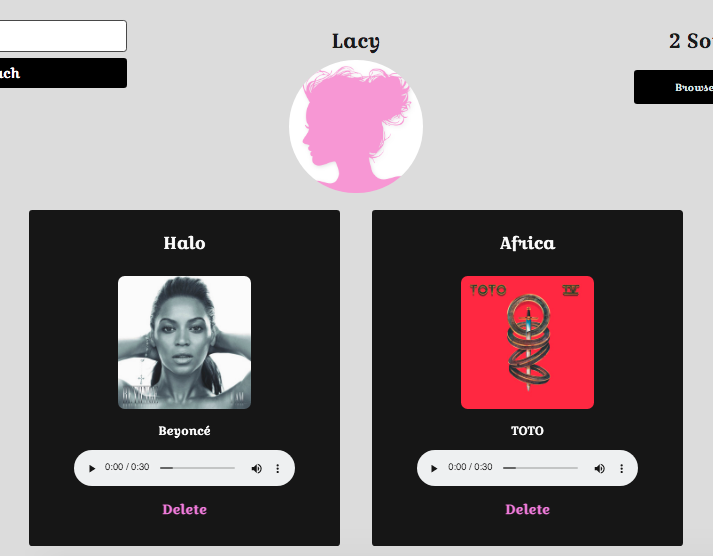

# one-track
browse the best songs. develop your own personal music library

## Table of Contents

  - [Team](#team)
  - [Description](#description)
  - [Technologies](#technologies)
  - [Deployment](#deployment)
  - [License](#license)
  - [Questions](#questions)
  - [Screenshots](#screenshots)

   ## Team

  Dev Team #1: Matt R., Mohamed A., Cortland S-B., Ted H.
  
  ## Description

  This is a PC and mobile app designed for a user who wants to browse a music database and develop a profile page for their favorite songs. It also has the potential in the future to function as a platform for artists to be able to upload their own tracks, album art, and profile information. 
  
  ## Technologies:

  * Front-end: CSS, Bootstrap, Google Fonts, Javascript, jQuery
  * Back-end: Sequelize, MySQL, mysql2, dotenv, bcrypt, axios, express, handlebars, session
  * Dev-deps: eslint, nodemon, prettier

  ## Deployment:

  To see the app in action, check out the deployed app on Heroku here >> 

  ## License
  
  
  
  ## Questions

  * If you have any questions/concerns regarding the app, please contact me on GitHub here (see portfolio app for email): https://github.com/tedheikkila

  * Here's the other collaborator's GitHub usernames as well: m-ray-ofSunshine, CortlandSB, mohamedabukar

## Screenshots

  * homepage (top)

  

   * homepage (bottom w/gallery images)

  

   * library page (logged out)

  

  * login & sign up forms 

  

  * sign up (close-up)

  

  * new user page

  

  * library page (logged in)

  

   * saved tracks (profile page)

  

  * mobile view (profile page)

  

  * delete a track (profile page)

  
